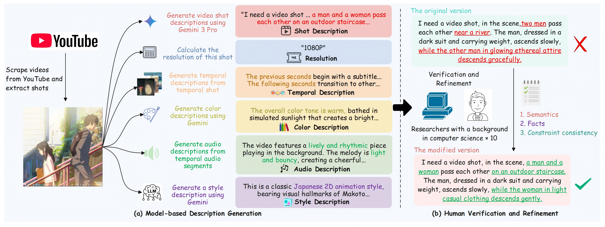
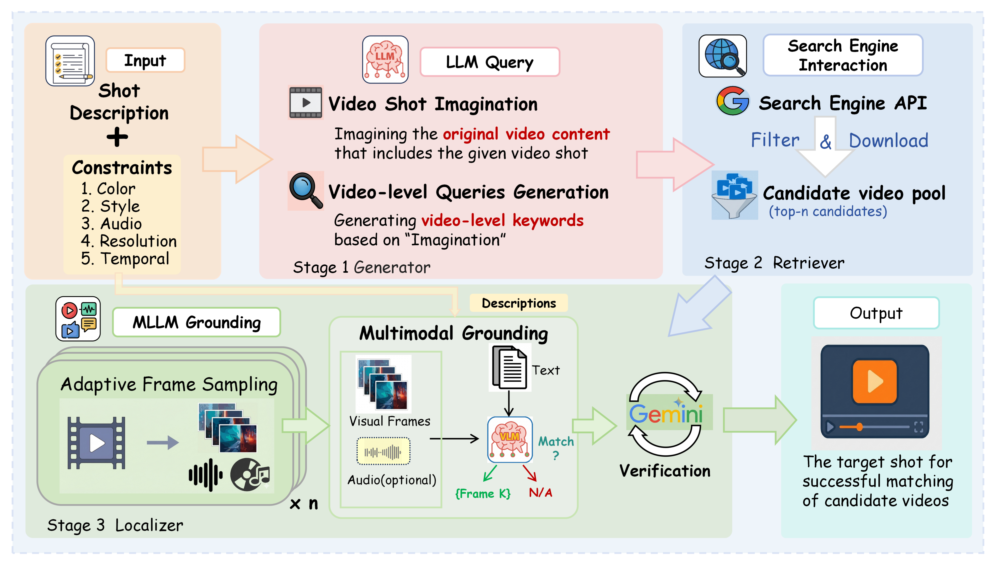

# ShotFinder: Imagination-Driven Open-Domain Video Shot Retrieval via Web Search


<p align="center">
  
</p>

<font size=3><div align='center' >  
[[📝 arXiv Paper](https://arxiv.org/abs/2601.23232)] [[🗂️ ShotFinder Data](https://huggingface.co/datasets/Kirito-Lab/ShotFinder)] 
</div></font>

---

### 📑 Table of Contents

- [🏷️ Key Components](#-key-components)
- [✨ Resources](#-resources)
- [🚀 Quick Start](#-quick-start)
- [📂 Project Structure](#-project-structure)
- [📜 Citation](#️-citation)

---

### 🏷️ Key Components

#### 1. **ShotFinder Benchmark**

<p align="center">
  
</p>

- **Curated Open-Domain Collection**: Contains **1,210 high-quality video samples** collected from YouTube across **20 diverse thematic categories** (e.g., Knowledge, Gaming, Fashion, Documentaries).

- **Constraint-Driven Task Design**: Defines 6 specific task settings: a core **Shot Description** task plus **5 single-factor constraints** (Temporal order, Color, Visual style, Audio, and Resolution) to isolate and analyze specific retrieval capabilities.

- **Human-Verified Construction**: Utilizes a **Model-based Description Generation** pipeline (using Gemini-3-Pro) followed by rigorous **Human Verification and Refinement** to ensure the dataset is semantically accurate and free of noise.

- **Constraint-Aware Topic Allocation**: Implements a strategic mapping of topics to constraints (e.g., mapping "Music" to Style tasks or "Fitness" to Temporal tasks) to reduce content bias while ensuring relevance.


#### 2. **ShotFinder Method**

<p align="center">
  
</p>

- **Three-Stage Retrieval Framework**: A text-driven system designed to locate specific shots in open-domain videos through **Generator**, **Retriever**, and **Localizer** modules.

- **Stage 1: Query Expansion via Video Imagination**: Unlike simple keyword extraction, the **Generator** uses an LLM to "imagine" the full video content and title from a short shot description, bridging the semantic gap between a specific shot and searchable video metadata.

- **Stage 2: Web Video Retrieval**: The **Retriever** interacts with search engines using the imagined queries to filter and download a set of candidate videos from the web.

- **Stage 3: Description-Guided Temporal Localization**: The **Localizer** employs MLLMs with **adaptive frame sampling** to analyze the candidate videos and pinpoint the exact start and end times of the target shot based on the text description.


---


### ✨ Resources
- 📝 **Paper (arXiv):**  https://arxiv.org/abs/2601.23232
- 🗂️ **Dataset (HF):**  https://huggingface.co/datasets/Kirito-Lab/ShotFinder

---

### 🚀 Quick Start


#### 1. **Clone this repository and navigate to the folder:**
```bash
git clone https://github.com/yutao1024/ShotFinder.git
cd ShotFinder
```

#### 2. **Install the inference package:**
```bash
conda create -n shotfinder python=3.11.5 -y
conda activate shotfinder
PYTHONNOUSERSITE=1 pip install -r requirements.txt
```

#### 3. **Data Preparation:**
Download [🗂️ ShotFinder Data](https://huggingface.co/datasets/Kirito-Lab/ShotFinder), unzip the datasets, and put the **`video_dataset.json`** in **`data_json/`**. The final structure should look like this:
```
ShotFinder/
├── data_json/               # Input Data
    └── video_dataset.json   # Source file containing video 
```

Based on the code files you provided, here is the continuation of the `README.md` document. This covers configuration, running the inference pipeline, and evaluation.


#### 4. **Configuration:**

Before running the code, you need to configure your **API** keys and environment settings.

1. **API Keys**: Open `config/config.yaml` (create it if it doesn't exist, using the structure below) and add your API keys. You will need a **SerpApi** key for the search agent and LLM keys for the models you intend to use.
```yaml
# config/config.yaml example
GEMINI_API_KEY: "your_gemini_key"
OPENAI_API_KEY: "your_openai_key"
ANTHROPIC_API_KEY: "your_anthropic_key"
SERPAPI_KEY: "your_serpapi_key" # Required for video search

# Paths
OUTPUT_DIR: "./output"
LOG_DIR: "./logs"
EXTRACT_FRAMES: "./frames"
RESULTS_DIR: "./results"
COOKIES_FILE: "./config/cookies.txt" # Required for yt-dlp
NODE_PATH: "/usr/bin/node" # Path to node.js (required for some yt-dlp extractors)

# Search Settings
URL_NUM: 2 # Number of chosen URLs
MAX_PAGE: 5 # Web pages to search
MAX_SEC: 3600 # Max video duration in seconds
```

2. **YouTube Cookies**: To ensure stable video downloading with `yt-dlp`, export your YouTube cookies to a Netscape formatted text file (e.g., using a browser extension) and save it as `config/cookies.txt`.
3. **Dependencies**: Ensure `ffmpeg` and `node` are installed on your system, as they are required for video processing and downloading.


#### 5. **Run Inference (Search & Grounding)**

Use `main.py` to run the full pipeline: Search -> Download -> Extract Frames -> Visual Grounding.

```bash
python main.py \
  --input_path ./data_json/video_dataset.json \
  --model_name "gemini-3-pro" \
  --config_path ./config/config.yaml
```

**Parameters:**

* `--input_path`: Path to the input JSON dataset.
* `--model_name`: The name of the LLM/VLM to use (e.g., `gemini-2.5-pro`, `gpt-5.2`, `claude-4.0-Sonnet`).
* `--config_path`: Path to your configuration file (default: `./config/config.yaml`).


#### 6. **Evaluation**

After running the inference, you can evaluate the performance using `evalution.py`. This script compares the grounding results against the dataset annotations and calculates accuracy across different categories (Shot, Temporal, Color, Style, etc.).

```bash
python evalution.py \
  --model_name "Gemini-2.5-Pro" \
  --dataset_path "./data_json/video_dataset.json" \
  --result_dir "./results/grounding_result" \
  --output_file "./results/evaluation_report.txt"
```

---


### 📂 Project Structure

```
ShotFinder/
├── config/                  # Configuration & Prompt Management
│   ├── config.yaml          # Global settings (API keys, output paths, etc.)
│   └── prompt.yaml          # System prompts for Search, Grounding, and Testing
├── data_json/               # Input Data
│   └── video_dataset.json   # Source file containing video descriptions and metadata
├── results/                 # System Outputs (Configurable via config.yaml)
│   ├── grounding_result/    # Phase 1: VLM frame matching results
│   ├── vlm_test/            # Phase 2: Success/Fail verification results
│   ├── audio_clip/          # Extracted 2-second audio clips for verification
│   └── final_report.txt     # Summary report generated by evaluation.py
├── logs/                    # Detailed Execution Logs
│   └── task_[filename]_[timestamp]/ # Unique directory per run
│       ├── config_and_prompt.log    # Snapshot of parameters & prompts used for the run
│       ├── data_[id_1].log          # Detailed trace for video task 1 (Search -> VLM)
│       ├── data_[id_2].log          # Detailed trace for video task 2
│       └── ...                      # Individual logs for each concurrent task
├── main.py                  # Orchestrator: Manages concurrency and the full pipeline
├── run_search_grounding.py   # Pipeline Logic: Higher-level flow (Download, Frame Extract)
├── agent_search.py          # Search Agent: LLM-based query planning and tool calling
├── vlm_grounding.py         # Grounding Logic: Coordinates VLM frame/audio analysis
├── llm_handler.py           # Model Adapter: Handles specific API calls
├── tools_lib.py             # Utility Library: YouTube validation and logging setup
├── evaluation.py            # Evaluation script: Calculates accuracy metrics across categories
├── generate.py              # Visual utility: Creates GIFs from PNG files
└──  requirements.txt         # Project dependencies

```
---


### 📜 Citation

If you find it useful for your research and applications, please cite related papers/blogs using this BibTeX:
```bibtex
@misc{yu2026shotfinderimaginationdrivenopendomainvideo,
      title={ShotFinder: Imagination-Driven Open-Domain Video Shot Retrieval via Web Search}, 
      author={Tao Yu and Haopeng Jin and Hao Wang and Shenghua Chai and Yujia Yang and Junhao Gong and Jiaming Guo and Minghui Zhang and Xinlong Chen and Zhenghao Zhang and Yuxuan Zhou and Yufei Xiong and Shanbin Zhang and Jiabing Yang and Hongzhu Yi and Xinming Wang and Cheng Zhong and Xiao Ma and Zhang Zhang and Yan Huang and Liang Wang},
      year={2026},
      eprint={2601.23232},
      archivePrefix={arXiv},
      primaryClass={cs.CV},
      url={https://arxiv.org/abs/2601.23232}, 
}
```


